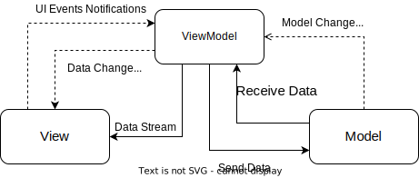

# Model View View Model (MVVM) Pattern

**MVVM** is a **_software architectural pattern_**. That pattern was created by _Microsoft_ and has being adopted by _Google_ as a recommended architecture for building robust, high-quality apps.

It is divided into **Model**, **View**, **ViewModel**, where:
- **Model** represents the abstraction of the data sources. It work together with **ViewModel** syncing the data with **UI**, since it does not have any directly interaction with the **View** layer. It houses the logic for the program, which is retrieved by the **ViewModel**
- **View** represents what the user sees on the screen. It displays a representation of the model and receives the user's interaction with the view. Its main purpose is to inform the **ViewModel** about the user's action. It observes the ViewModel data and does not contain any kind of application logic.
- **ViewModel** is located between both **View** and **Model** layers, acting as a link. It's responsible for transforming the data from the **Model** and serving it to the **View** via data streams. It also use hooks or callbacks to update the **View**.

The following chart ilustrates the core of **MVVM** Pattern




The **MVVM** pattern has some similiarities with the **MVP** (Model  View Presenter) where the main difference is between the **Presenter** and the **ViewModel**. 

In **MVP**, the **Presenter** holds a reference of the **View** and updates the **View** triggering **View**'s methods. The relationship between **View** and **Presenter** is 1:1.

On the other hand, **ViewModel** does not know at all the **View** and it does not know that the view is listening to it. The relationshiph between **View** and **ViewModel** is 1:N.

The **ViewModel** does not know that a **View** is listening to it. It provides data streams to the **View**s listening. That is how the view gets updated.

# How does it work on Android
There are two ways to implement **MVVM** on Android:
1. Using [**DataBinding**](https://developer.android.com/topic/libraries/data-binding?hl=pt-br) library
2. Using libraries that implements the observable pattern, like [**LiveData**](https://developer.android.com/topic/libraries/architecture/livedata), [**Kotlin Flow**](https://kotlinlang.org/docs/flow.html#flows) or [**RxJava**](https://github.com/ReactiveX/RxJava).

## Using Data binding library
> The Data Binding Library is a support library that allows you to bind UI components in your layouts to data sources in your app using a declarative format rather than programmatically.

The Data Binding Library can bind the UI with the ViewModel with two approachs

- **One-way data binding**: When an UI element is bind with a property of an object without being able to reflect changes from user to the target object. Using one-way data binding, you can set a value on an attribute and set a listener that reacts to a change in that attribute:

```xml
<!-- Note: The syntax of one-way data binding is: @{variable} -->
<CheckBox
    android:id="@+id/rememberMeCheckBox"
    android:checked="@{viewmodel.rememberMe}"
    android:onCheckedChanged="@{viewmodel.rememberMeChanged}"
/>
```
- **Two-way data binding**: When an UI element is bind with a property of an object being able to reflect changes from user to the target object. Using two-way data binding, the component binded will receives data changes from the property and listen to the user updates at the same time:

```xml
<!-- Note: The syntax of two-way data binding is: @={variable} -->
<CheckBox
    android:id="@+id/rememberMeCheckBox"
    android:checked="@={viewmodel.rememberMe}"
/>
```

As per [Google's documentation](https://developer.android.com/topic/libraries/data-binding/two-way):

In order to react to changes in the backing data, you can make your layout variable an implementation of `Observable`, usually `BaseObservable`, and use a `@Bindable` annotation, as shown in the following code snippet:

```kotlin
class LoginViewModel : BaseObservable {
    // val data = ...

    @Bindable
    fun getRememberMe(): Boolean {
        return data.rememberMe
    }

    fun setRememberMe(value: Boolean) {
        // Avoids infinite loops.
        if (data.rememberMe != value) {
            data.rememberMe = value

            // React to the change.
            saveData()

            // Notify observers of a new value.
            notifyPropertyChanged(BR.remember_me)
        }
    }
}
```
Because the bindable property's getter method is called `getRememberMe()`, the property's corresponding setter method automatically uses the name `setRememberMe()`.

For more information of data binding, see the sample folder.

## Using Observable Library


# References
- [Model–view–viewmodel by Wikipedia](https://en.wikipedia.org/wiki/Model%E2%80%93view%E2%80%93viewmodel)
- [Model-View-ViewModel (MVVM) by WhatIs.com](https://whatis.techtarget.com/definition/Model-View-ViewModel)
- [Model-View-ViewModel (MVVM) Explained by atmosera](https://www.atmosera.com/blog/model-view-viewmodel-mvvm-explained/)
- [MVVM (Model View ViewModel) Architecture Pattern in Android by GeeksforGeeks](https://www.geeksforgeeks.org/mvvm-model-view-viewmodel-architecture-pattern-in-android/)
- [Android MVVM Design Pattern by JournalDev](https://www.journaldev.com/20292/android-mvvm-design-pattern)